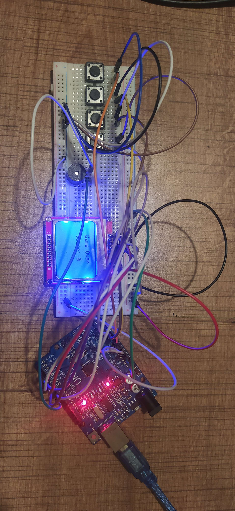

# Arduino Snake Game

## Introduction

This project is a simple snake game developed using the Arduino platform and PlatformIO. The game utilizes 4 buttons, 1 buzzer, and a Nokia 5510 LCD screen.

## Components

- 4 buttons
- 1 buzzer
- 1 Nokia 5510 LCD screen
- Arduino board

## Dependencies

- [PlatformIO](https://platformio.org/)

## Installation

1. Download and install [PlatformIO](https://platformio.org/install).
2. Connect your Arduino board to your computer.
3. Open the project 

## License

This project is licensed under the MIT License. For detailed information, refer to the [LICENSE](LICENSE) file.
